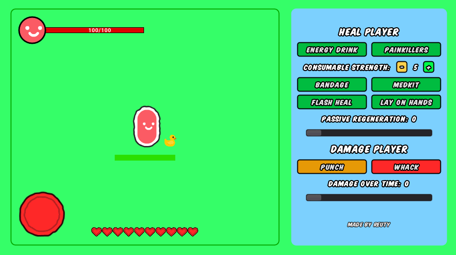
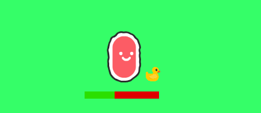
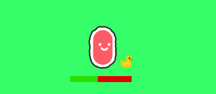
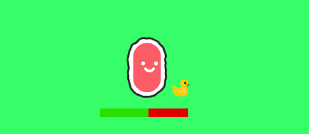
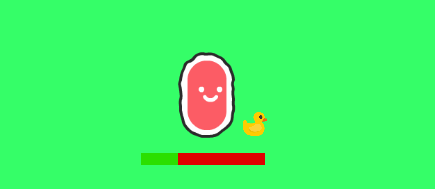
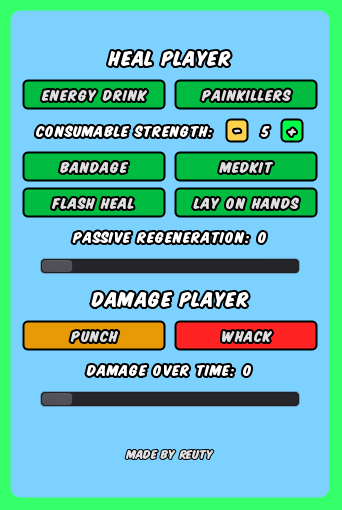
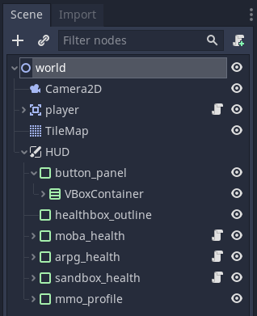

# `Reuty's Health Lab - Welcome!`

This project provides some code for learning and testing healing mechanics found across many types of game. The project also includes a few different types of health display, like the MMO type profile in the top right, an ARPG 'health bowl' in the bottom left, a heart type system in the center at the bottom, and a standard no-frills health bar in the center.

This project is designed to help you learn how these types of mechanisms can be implemented in games, and particularly how to do it using the Godot engine. Feel free to use this code anywhere you like, crediting [@not_reuty](https://twitter.com/not_reuty) is not required but greatly appreciated!

A huge thank you to [Kenney](https://twitter.com/KenneyNL) for making the assets public, and to the creator of [Komika Title](https://www.dafont.com/komika-title.font) (the font used throughout)!

## `Active Healing`
Active healing comes in many forms, from item pickups, to consumables, spells, and more. This project contains code for three types of active healing, i) consumable heal-over-time, ii) consumable instant heal, and iii) regular instant heal (like an instant cast spell).

Each are slightly different, see below for details;

### `Energy Drink`
An energy drink is a consumable item which gives a heal-over-time effect for a few seconds. The strength of the healing effect can be changed with the `consumable strength` buttons, which shows how many points of health are healed per second the effect is active. Drinking an energy drink extends the duration of any existing regeneration effect, like in battle royale games.

### `Painkillers`
Painkillers are similar to energy drinks but take longer to apply, and their effect lasts longer. The strength of the regeneration effect applied by painkillers is the same as energy drinks, but since they last longer their overall heal is greater.

The healing effect given by both energy drinks and painkillers doesn't end if the player reaches full health. If they take damage after using either of them, any remaining effect will be applied.

### `Bandage`
A bandage is a consumable which heals a small amount of health instantly following a short delay. It cannot heal the player over maximum health, and will not affect any damage taken after the bandage has been applied (unlike the over-time regen provided by energy drinks and painkillers).

### `Medkit`
A medkit is a consumable which heals the player to full health instantly following a long delay. Like the bandage, it can't heal the player over maximum health.

### `Flash Heal`
The flash heal is like a bandage but takes no time to heal (like an instant cast spell). 

### `Lay On Hands`
The lay on hands is like a medkit but takes no time to heal. It's useful for resetting the player's health to test the strength of the damage over time effect in the damage section.

## `Damaging the Player`
This project is all about healing, but to make that possible we need a way to damage the player. The `punch` and `whack` buttons do a small amount of damage, or bring the player to 5 health respectively. Below these two instant damage buttons, the damage over time slider lets you set a constant damage effect, which will be applied every game tick and whose value represents the damage taken by the player per second.

## `User Interface`
The UI links into the player's code through the `pressed()` and `value_changed()` events, which then set boolean values in the player directly. In an actual game this could be called from an inventory manager or similar if the player had the right healing items in their bags.

## `Project Structure`
The project structure is fairly flat, with a single player node plus a `CanvasLayer` which holds all of the UI elements. One non-intuitive part is that the consumable indicators are children of the player node, *not* the UI canvas. This is so that if the player moves, the indicators will follow if the camera stays where it is. Feel free to change/adapt this as needed in your projects!

### `Other Interesting Bits`
Although this project is all about healing mechanics, there are some other cool bits to point out;
- the consumable strength UI is custom coded because I couldn't find any +- buttons built in
- 

## `Want to know more?`
I'd like to help - tweet me [@not_reuty](https://twitter.com/not_reuty) any questions you have about this project and I'll do my best to answer them. Good Luck!
